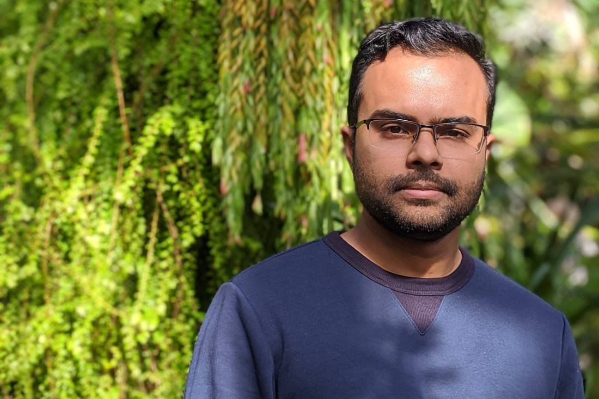

I am a Senior Modeler at [Moody's RMS](https://www.rms.com/) and a PhD candidate in Electrical & Computer Engineering at Georgia Tech, advised by [Dr. Vince Calhoun](https://en.wikipedia.org/wiki/Vince_Calhoun).
My interests include digital signal and image processing, machine learning, data science and generally any problem that can be solved using a computer.

> As part of the Model Certification team at Moody's RMS, I prototype and certify catastrophe risk models before deployment in the client-facing products.

I worked as a graduate research assistant at the [TReNDS Center](http://trendscenter.org), Atlanta, GA. Check out my <a href="https://scholar.google.com/citations?user=ahkZvZQAAAAJ&hl=en">Google Scholar</a> profile for a list of my publications.

I live in San Antonio, TX with my <a href="http://aminamannan.com/">beautiful wife</a> and our son Aydin.

